# OpsBeacon AI: An Always-On AI DevOps Intelligence Agent

[](https://github.com/opsbeacon-ai/opsbeacon-ai/actions/workflows/ci.yml)
[](LICENSE)
[](https://aws.amazon.com/)
[](https://aws.amazon.com/bedrock/)

**OpsBeacon AI** is a personal, always-on DevOps assistant that runs unattended to keep engineers informed and learning. Every morning at **8:00 AM UTC**, it aggregates cloud and containerization updates, processes them using Amazon Bedrock Nova Lite, and emails a daily digest to the user via Amazon SES.

The entire process is automated, serverless, and runs within the AWS Free Tier (costing under $0.02 per month).

---

## 🌟 Main Features

* **Unattended Execution**: Triggered automatically every day at 8:00 AM UTC by EventBridge Scheduler.
* **Aggregated Feeds**: Automatically scrapes technical updates from:
  * AWS What's New
  * Kubernetes Blog
  * CNCF Blog
  * Docker Blog
* **AI Analysis (Nova Lite)**: Filters duplicates and marketing copy, technical summaries, details operational engineering impacts, and states why updates matter.
* **Brain Boost Learning**: Automatically generates:
  * A scenario-based DevOps interview question based on the updates.
  * A 30-minute hands-on practice challenge.
  * Research/topic recommendations.
* **Styled Briefings**: Sends newsletters via Amazon SES using responsive HTML templates.
* **Structured Auditing**: Emits structured JSON logs to CloudWatch.

---

## 📐 System Architecture

The following diagram illustrates the serverless workflow of the agent:

```mermaid
graph TD
    A[EventBridge Scheduler] -->|cron 0 8 * * ? *| B[AWS Lambda Function]
    B -->|Fetch RSS XML| C[RSS Feeds]
    C -->|Parse last 24h updates| B
    B -->|Prompt with JSON Schema| D[Amazon Bedrock Nova Lite]
    D -->|Return structured JSON| B
    B -->|Compile HTML Template| E[Jinja2 Renderer]
    B -->|Dispatch HTML Email| F[Amazon SES]
    F -->|Deliver briefing| G[DevOps Engineer Inbox]
```



For sequence diagrams and Draw.io assets, see [Architecture Documentation](docs/architecture.md).

---

## 📂 Project Structure

```text
OpsBeacon-AI/
├── .github/
│   └── workflows/
│       └── ci.yml             # GitHub Actions CI pipeline
├── deploy/                    # Deployment scripts or local environment configs
├── docs/                      # Extensive markdown guides
│   ├── assets/                # Diagram assets (Draw.io, SVG, PNG)
│   ├── architecture.md        # Architecture & sequence diagrams
│   ├── builder-center-article.md # Challenge article (~1100 words)
│   ├── COST.md                # Cost breakdown ($0.0126/month)
│   ├── demo-script.md         # 2-minute video presentation guide
│   ├── DEPLOYMENT.md          # Guide for Bedrock access, SES setup & SAM CLI
│   ├── LOCAL_SETUP.md         # Virtual env and local testing guide
│   ├── ROADMAP.md             # Future product roadmap
│   ├── SUBMISSION_CHECKLIST.md # Submission verification checklist
│   └── TROUBLESHOOTING.md     # Error codes and resolution protocols
├── screenshots/               # Folder for demo images
├── scripts/                   # Local automation run scripts
├── src/                       # Application code
│   ├── __init__.py
│   ├── app.py                 # Lambda handler orchestrator
│   ├── bedrock_client.py      # Bedrock converse client (Nova Lite)
│   ├── config.py              # Environment config validation
│   ├── email_generator.py     # HTML Template & Jinja compiler
│   ├── logger.py              # Structured JSON logging formatter
│   ├── rss_parser.py          # RSS feed aggregator and date filter
│   └── ses_client.py          # SES email dispatch handler
├── tests/                     # Unit test suite (Pytest)
│   ├── __init__.py
│   ├── test_app.py
│   ├── test_bedrock_client.py
│   ├── test_email_generator.py
│   ├── test_rss_parser.py
│   └── test_ses_client.py
├── .env.example               # Environmental configuration template
├── .gitignore                 # Standard file exclusions
├── CHANGELOG.md               # Version update tracking
├── CODE_OF_CONDUCT.md         # Contributor Covenant
├── CONTRIBUTING.md            # Coding standards & git workflows
├── LICENSE                    # MIT open-source license
├── requirements.txt           # Python application dependencies
├── samconfig.toml             # AWS SAM deployment configuration
├── SECURITY.md                # Vulnerability disclosure policy
└── template.yaml              # AWS SAM Infrastructure template
```

---

## 🚀 Quick Setup & Deployment

### 1. Prerequisites
Ensure you have the [AWS CLI](https://aws.amazon.com/cli/) and [AWS SAM CLI](https://aws.amazon.com/serverless/sam/) installed.

### 2. Configure AWS Account Settings
1. **Enable Bedrock Nova Lite**: Go to the AWS Bedrock Console -> **Model access** -> **Manage model access** -> Request access for **Nova Lite**.
2. **Verify SES Emails**: Go to the AWS SES Console -> **Verified identities** -> **Create identity** -> Verify both your sender and recipient email addresses.

### 3. Deploy using AWS SAM
Run the following commands in the workspace directory:
```bash
sam build
sam deploy --guided
```
Provide the verified sender and recipient emails when prompted.

For a detailed walkthrough, follow the [Deployment Guide](docs/DEPLOYMENT.md).

---

## 💻 Local Development & Testing

Setting up a local environment for modification:

```bash
# Setup virtual environment
python -m venv venv
source venv/bin/activate  # Windows: .\venv\Scripts\Activate.ps1

# Install requirements
pip install -r requirements.txt

# Run pytest unit tests
pytest -v
```
Refer to the [Local Setup Guide](docs/LOCAL_SETUP.md) for more details.

---

## 📊 cost & Free Tier

OpsBeacon AI operates **entirely within the AWS Free Tier** for Lambda, EventBridge, CloudWatch, and SES.
* The only non-free service is Amazon Bedrock Nova Lite, which costs **~$0.00042 per daily run**.
* The total estimated monthly running cost is **$0.013 USD** (approximately **one cent**).

See the [Cost Guide](docs/COST.md) for the exact breakdown.

---

## 🎥 Recording the Demo

We have prepared a step-by-step recording guide for your AWS submission video. It covers setting up your AWS Console, triggering a mock execution, and checking your inbox. See the [Demo Script](docs/demo-script.md) for the complete 2-minute outline.

---

## 📄 License

This project is licensed under the MIT License - see the [LICENSE](LICENSE) file for details.
