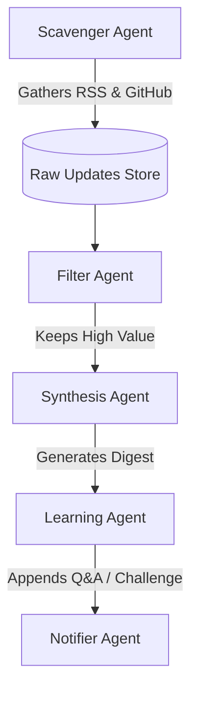

# OpsBeacon AI - Product Roadmap

This document outlines the planned future features and architecture expansions for **OpsBeacon AI**.

---

## 🚀 Phase 1: Notification & Channel Expansions (Short-term)

To expand OpsBeacon's capability beyond email (Amazon SES) and deliver real-time team alerts, the following notification integrations are planned:

* **Slack App Integration**: Publish curated updates, interview questions, and challenges directly to a Slack channel using Incoming Webhooks or an official Slack App.
* **Discord & MS Teams Webhooks**: Support Slack-compatible payloads to push notifications directly into Discord developer channels or Microsoft Teams spaces.
* **Telegram & WhatsApp Bot**: Enable direct delivery to personal message channels for engineers who prefer mobile chat app delivery.

---

## 🧠 Phase 2: Multi-Agent & RAG Pipeline (Medium-term)

To handle larger volumes of feeds, more sources, and deep technical learning, the single-function architecture will evolve into a multi-agent workflow:

* **Multi-Agent Orchestration**:
  * *Scavenger Agent*: Periodically aggregates hundreds of feeds, GitHub release notes, and blogs.
  * *Filter Agent*: Filters noise, duplicates, and marketing copy using cheap models.
  * *Synthesis Agent*: Summarizes the updates and extracts actionable items.
  * *Learning Agent*: Generates tailored interview questions and challenges.
* **Retrieval-Augmented Generation (RAG)**:
  * Store summaries in **Amazon OpenSearch Serverless** or **pgvector** on RDS.
  * Allow users to query the archive: *"What AWS Lambda updates occurred in the last month?"* or *"Generate an interview question on Kubernetes based on releases from June 2026."*

---

## 🖥️ Phase 3: OpsBeacon Web Portal (Long-term)

A premium user interface to manage feeds, track history, and check statistics:

* **Web UI Dashboard**: Built with **Next.js** and hosted on **AWS Amplify**.
* **Configuration Manager**: Add, edit, or remove RSS feed subscriptions.
* **Archive Viewer**: Browse previous newsletters, check answers to interview questions, and submit solutions to hands-on challenges.
* **Analytics**: Track feed activity, keyword frequency, and personal learning progress.
