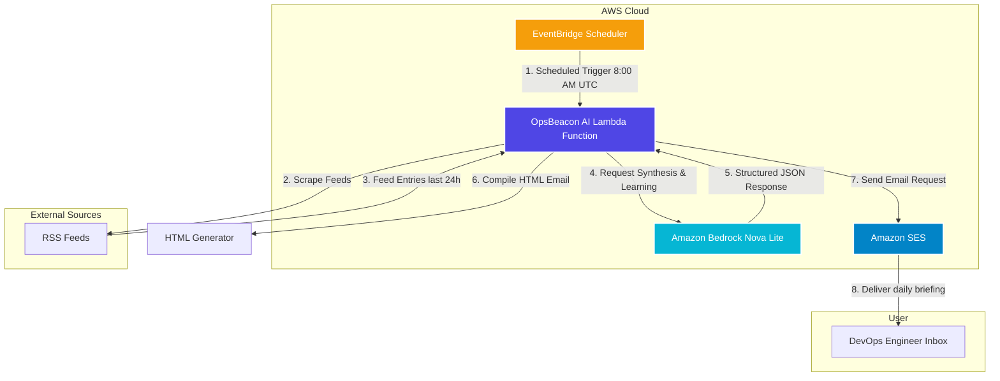
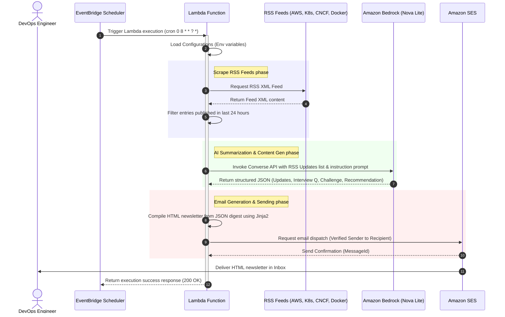

# OpsBeacon AI - Architecture Documentation

This document outlines the architecture, data flow, and design patterns utilized in **OpsBeacon AI: An Always-On AI DevOps Intelligence Agent**.

OpsBeacon AI operates as a completely serverless, automated agent on AWS, utilizing AWS Free Tier services where possible.

## System Architecture Diagram

Below is the high-level system architecture illustrating how the EventBridge Scheduler triggers the orchestration Lambda, which interacts with RSS feeds, Bedrock Nova Lite, and SES.

## System Sequence Diagram

This sequence diagram depicts the chronological flow of execution when the EventBridge Scheduler fires.

## Component Breakdown

1. **Amazon EventBridge Scheduler**: Triggered every morning at 8:00 AM UTC. It leverages the modern `AWS::Scheduler::Schedule` resource, invoking the Lambda target.
2. **AWS Lambda**: The orchestrator written in Python 3.12. It packages code, fetches feeds using `feedparser`, interacts with Bedrock Runtime via `boto3`, generates templates with `Jinja2`, and submits to SES.
3. **Amazon Bedrock (Nova Lite)**: Synthesizes the filtered updates. We use Nova Lite (`amazon.nova-lite-v1:0`) because it is fast, cost-effective, and highly capable of following structured output instructions (JSON schemas).
4. **HTML Generator**: Compiles a professional newsletter. We use Jinja2 to render cards, badges, and callouts matching corporate DevOps brand aesthetics.
5. **Amazon SES**: Transmits the message over SMTP/API using TLS. It restricts traffic to verified domain identities to enforce security.
6. **Amazon CloudWatch Logs**: Captures structured JSON log streams printed by our custom logger, facilitating auditing, metrics compilation, and troubleshooting.

## Diagram Assets Directory
For drawing applications (e.g., Draw.io):
- **Draw.io editable source file**: Deployed under [docs/assets/architecture.drawio](file:///d:/AWS-weekend-challenge/docs/assets/architecture.drawio) (Instructions: Import this XML script inside [draw.io](https://app.diagrams.net/) to edit the diagrams).
- **SVG export**: Deployed under [docs/assets/architecture.svg](file:///d:/AWS-weekend-challenge/docs/assets/architecture.svg).
- **PNG export**: Deployed under [docs/assets/architecture.png](file:///d:/AWS-weekend-challenge/docs/assets/architecture.png).

<!-- IMAGE_PLACEHOLDER: Architecture Diagram -->
*Note: Capture a screenshot of the system architecture diagram rendered above or from Draw.io to display in the final project documentation.*
