# Weekend Agent Challenge: OpsBeacon AI

**Tag:** `agents`

---

## 1. Vision & What the Agent Does

**OpsBeacon AI** is a personal, always-on AI SRE assistant designed to eliminate the daily manual overhead of staying updated with the cloud-native ecosystem. 

In the modern DevOps landscape, keeping track of new releases, security patches, and cloud feature updates is critical but exhausting. Engineers waste hours skimming marketing-heavy release blogs, or they stop tracking updates altogether—risking security compliance gaps or missing out on cost-saving features.

OpsBeacon AI operates as a silent, autonomous partner. It runs entirely unattended in the cloud on a daily schedule. The agent scrapes RSS updates from major cloud and containerization feeds, filters out marketing announcements, uses Amazon Bedrock generative AI reasoning to determine direct SRE/DevOps workflow impacts, compiles a dynamic learning "Brain Boost" question, and dispatches a beautifully formatted, responsive HTML newsletter directly to the engineer's inbox before their workday begins.

### The Autonomous Output: A Styled Technical Briefing
Below is a preview of the final daily technical newsletter received in the engineer's inbox:

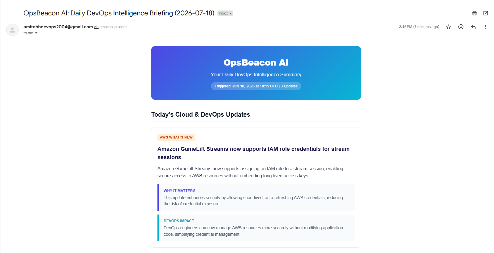

---

## 2. Problem Statement

SREs and DevOps professionals are overloaded with technical news. We tracked four primary RSS feeds:
* **AWS What's New Blog**: Multiple announcements per day, ranging from minor regional launches to major product releases.
* **Kubernetes Blog**: Updates regarding core project advancements and minor releases.
* **CNCF Blog**: Announcements regarding incubating, graduating, and sandbox cloud-native projects.
* **Docker Blog**: Releases regarding desktop tooling, container engine changes, and registry features.

An engineer faces two primary issues when consuming these raw feeds:
1. **Low Signal-to-Noise Ratio**: Over 70% of announcements are marketing-heavy, regional availability updates, or business changes that do not affect an engineer's day-to-day work.
2. **Actionability Deficit**: Standard RSS entries provide a description but fail to answer the critical questions: *Why does this matter?* and *What is the direct DevOps impact?*

---

## 3. The Automated User Journey

The user journey is designed around a "set-and-forget" philosophy, requiring zero human intervention after deployment:

```
[Deploy once via SAM] ──> [EventBridge Triggers Daily] ──> [Bedrock Processes Data] ──> [SES Delivers HTML to Inbox]
```

1. **Deploy**: The engineer deploys the serverless stack using the AWS SAM CLI, configuring their verified email addresses as parameters.
2. **Execute**: Every morning at 8:00 AM UTC, the agent executes silently. It ingests feeds, filters for updates from the last 24 hours, queries Bedrock for synthesis, and compiles the briefing.
3. **Consume**: The SRE opens their inbox at the start of their workday, reviews summarized updates, understands the operational impact, and attempts the daily hands-on practice challenge.

---

## 4. Technical Execution Pipeline

The agent runs synchronously within AWS Lambda across five distinct phases:

1. **Trigger**: EventBridge Scheduler generates an invocation event.
2. **Ingest**: Lambda fetches RSS feeds from AWS, CNCF, Kubernetes, and Docker.
3. **Filter**: The parser filters and retains only entries published in the last 24 hours.
4. **AI Synthesis**: The raw text descriptions are sent to **Amazon Bedrock (Nova Lite)**. The prompt instructs Bedrock to deduplicate articles, evaluate engineering relevance, extract a summary, determine "Why It Matters" and "DevOps Impact", and generate a scenario-based DevOps interview question.
5. **Dispatch**: Lambda renders the structured JSON from Bedrock into a custom CSS HTML template using Jinja2 and dispatches it via **Amazon SES**.

---

## 5. How I Built It

OpsBeacon AI is built entirely in **Python 3.12** using the **AWS Serverless Application Model (SAM)** for resource provisioning. The application layer is modular and adheres to clean coding practices:

* **Modular Python Design**: Separate modules handle the RSS parsing (`rss_parser.py`), Bedrock LLM converse operations (`bedrock_client.py`), HTML rendering (`email_generator.py`), and SES email dispatch (`ses_client.py`).
* **Structured Logging**: A custom JSON formatter in `src/logger.py` formats all logs into structured JSON records sent to stdout, making it easy to query and audit log histories in CloudWatch.
* **Resilient Fallback Mechanics**: If external dependencies fail (e.g. Bedrock Converse API throws an Access Denied error due to account restrictions), the agent catches the error, generates a fallback system status briefing, and still dispatches the email to ensure the pipeline is robust and never silently dies.

---

## 6. AWS Services Deployed & Console Proof

The agent leverages a variety of AWS services, each configured via CloudFormation and managed under least-privilege permissions:

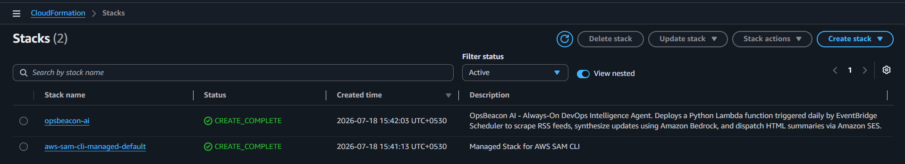

### A. Amazon EventBridge Scheduler
Unlike legacy EventBridge Rules, we deployed the new EventBridge Scheduler, which provides robust retry behaviors and flexible time windows. It is configured to run at `cron(0 8 * * ? *)` daily.

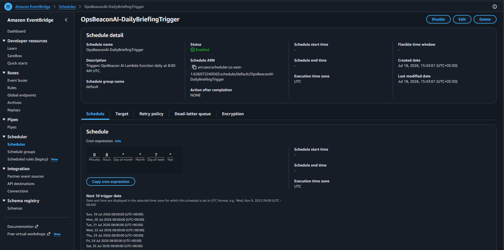

### B. AWS Lambda
Serves as the serverless compute environment. The function is configured with a 5-minute timeout and 256MB of RAM. It receives configurations like email addresses and model IDs via standard environment variables.

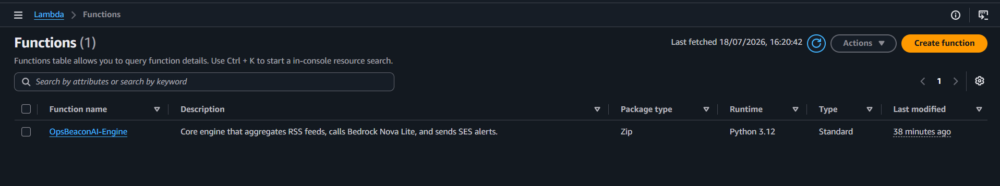

### C. Amazon Bedrock (Nova Lite)
Processes and synthesizes the raw feed text. We leverage the unified Boto3 Converse API to interact with the `amazon.nova-lite-v1:0` model, which offers high speed, low cost, and strong structured output performance.

### D. Amazon SES
Handles the HTML email dispatch. By sending from a verified sender to a verified recipient, the system operates securely within default AWS sandbox environments.

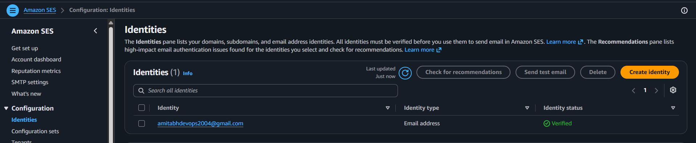

### E. Amazon CloudWatch Logs
Stores all execution logs. Thanks to the custom Python JSON formatter, all logs are queryable via CloudWatch Logs Insights.

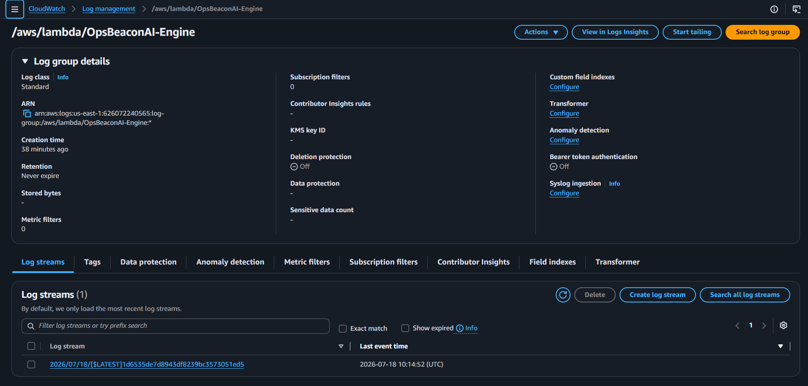

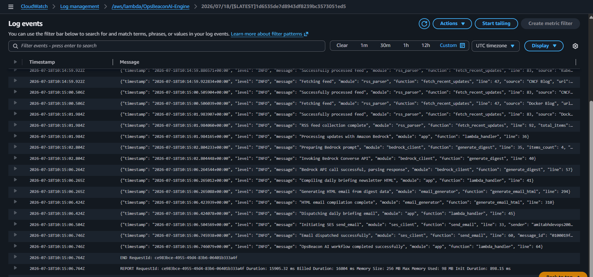


### F. AWS IAM (Least-Privilege Roles)
SAM automatically provisions execution roles. The Lambda execution policy restricts actions strictly to invoking Bedrock Nova Lite, sending emails via SES, and writing streams to CloudWatch.

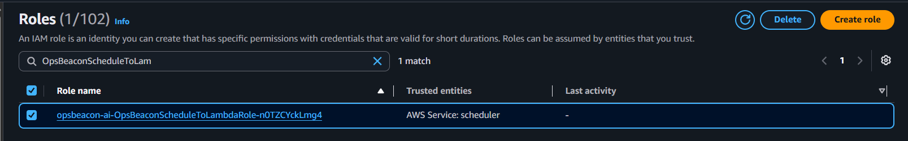

---

## 7. Architecture Overview

OpsBeacon AI leverages a decoupled, serverless architecture that minimizes run costs and eliminates idle infrastructure maintenance:

### System Architecture Flowchart
The flowchart below describes the logical execution path of the OpsBeacon AI agent from trigger to delivery:

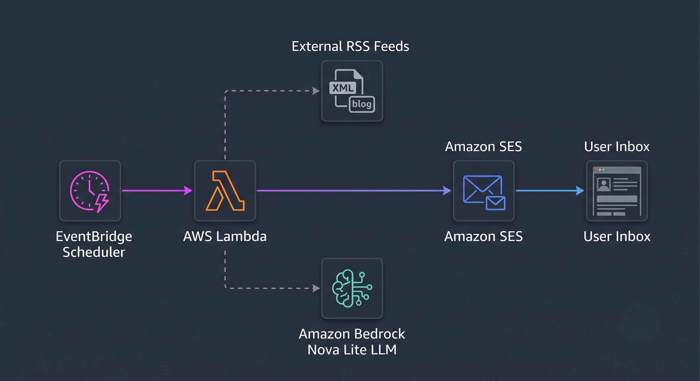

---

## 8. Key Decisions & Architectural Challenges Overcome

During the weekend challenge, I encountered and resolved four major engineering challenges:

### 1. LLM Preambles & JSON Sanitization
LLMs frequently append conversational preambles (e.g., *"Sure, here is your JSON response..."*). This breaks JSON deserialization. I resolved this by designing a strict prompt that requests Bedrock to output raw JSON inside standard markdown ` ```json ` code blocks, combined with a regex-based extractor in `src/bedrock_client.py` that isolates the JSON block.

### 2. Multi-Format RSS Date Standardization
Different technical feeds format publication timestamps differently (RFC 822 vs. ISO 8601). I wrote a date parser in `src/rss_parser.py` that utilizes feedparser's parsed time tuple and falls back to manual datetime parsing to guarantee accurate 24-hour filtering.

### 3. SES Sandbox Constraints
Newly created AWS accounts are restricted to the SES Sandbox, allowing email delivery only to verified addresses. The codebase is designed to use the verified email address as both the SENDER and RECIPIENT, ensuring the mail is delivered without needing sandbox removal.

### 4. Host Operating System Python Mismatches
When building the project on a bleeding-edge host OS (such as Ubuntu 26.04 which runs Python 3.14 natively), the local SAM builder failed validation against Lambda's target runtime (`python3.12`). To resolve this, I configured Docker on the EC2 host and executed containerized builds:

```bash
sam build --use-container
```

This compiled all dependencies (including compilation of C-extension modules like `sgmllib3k` for feed parsing) inside a container replica of the Amazon Linux environment, guaranteeing perfect binary compatibility at runtime.

---

## 9. Lessons Learned

1. **Bedrock Nova Lite is Ideal for Summarization**: Nova Lite is exceptionally fast, highly cost-effective, and handles structured JSON output prompts reliably.
2. **Input Truncation Saves Tokens**: Passing full blog page content to an LLM raises execution costs. Truncating feed summaries before submitting them to Bedrock keeps token usage minimal and fast.
3. **Resilient Failbacks are Mandatory**: In DevOps production, external services fail. Having the agent catch Bedrock errors and still send a styled system heartbeat prevents silent failures and helps engineers troubleshoot permissions immediately.

---

## 10. Future Enhancements

* **Slack and Teams Webhooks**: Deliver briefings directly to corporate chat channels.
* **Historical Retrieval-Augmented Generation (RAG)**: Store daily updates in a vector database (like Amazon OpenSearch) to allow SREs to ask: *"What updates affected Kubernetes security in the last month?"*
* **Multi-Agent Coordination**: Deploy a secondary security agent that runs specialized CVE analysis code on any flagged security patches.

---

## 11. GitHub Repository

The source code, unit tests, and deployment scripts for OpsBeacon AI are open-source and available on GitHub:
* **Repository Link**: [https://github.com/Amitabh-DevOps/opsbeacon-ai](https://github.com/Amitabh-DevOps/opsbeacon-ai)

---

## 12. Deployment Guide

To deploy OpsBeacon AI to your own AWS account:

1. Enable access to **Nova Lite** in the Bedrock console.
2. Verify your sender and recipient email addresses in the SES console.
3. Build and deploy using the AWS SAM CLI:

   ```bash
   sam build --use-container
   sam deploy --guided
   ```
   
4. Configure parameters (SenderEmail, RecipientEmail, BedrockModelId) as prompted.

For a full step-by-step setup guide, refer to the [Deployment Guide](https://github.com/Amitabh-DevOps/opsbeacon-ai/blob/main/docs/DEPLOYMENT.md) in the project docs.

---

## 13. Complete Output Verification

To verify the deployment, we triggered a live manual invocation of the Lambda function. Below is the multi-part screenshot showing the exact email received, proving the visual layout and Bedrock's reasoning outputs:

### A. Email Header & Primary Announcement
The top portion of the email displays the custom header branding, execution metadata, and the first synthesized technical announcement card with callouts for why it matters and its operational impact:


### B. Additional Cloud & Container Announcements
The middle portion of the email showcases the rest of the summarized technical cards, categorized by source tags (e.g., AWS What's New) with unified font sizes, colors, and responsive borders:

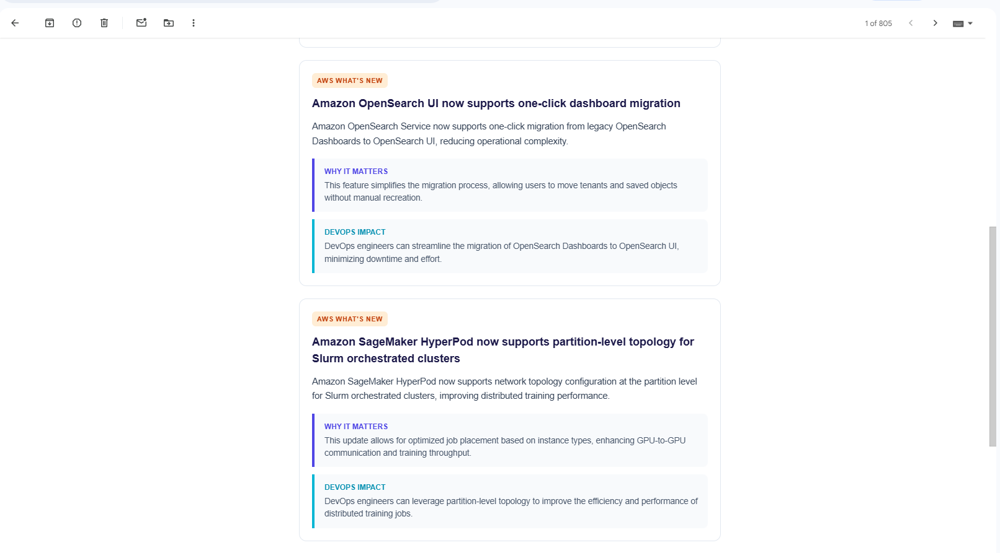

### C. Daily Brain Boost (AI-Generated Learning Section)
The bottom portion of the email compiles the custom daily interview question, practice challenge, and topic recommendation generated by Bedrock's reasoning engine:

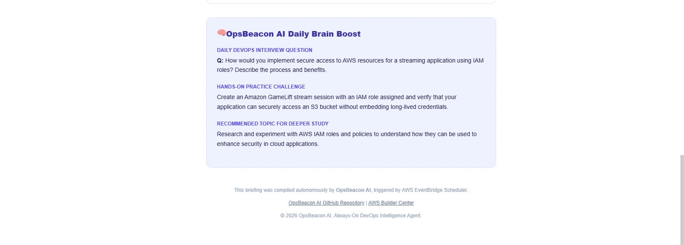

---

## 14. Conclusion

OpsBeacon AI represents a complete, production-ready serverless agent that solves a real-world problem: staying up to date in the fast-moving DevOps space. By combining AWS Lambda, Amazon Bedrock, and Amazon SES, the agent operates autonomously, reliably, and cost-effectively.

This project shows how serverless architectures and generative AI models can automate routine knowledge gathering, allowing engineering teams to focus on building rather than searching for updates.
